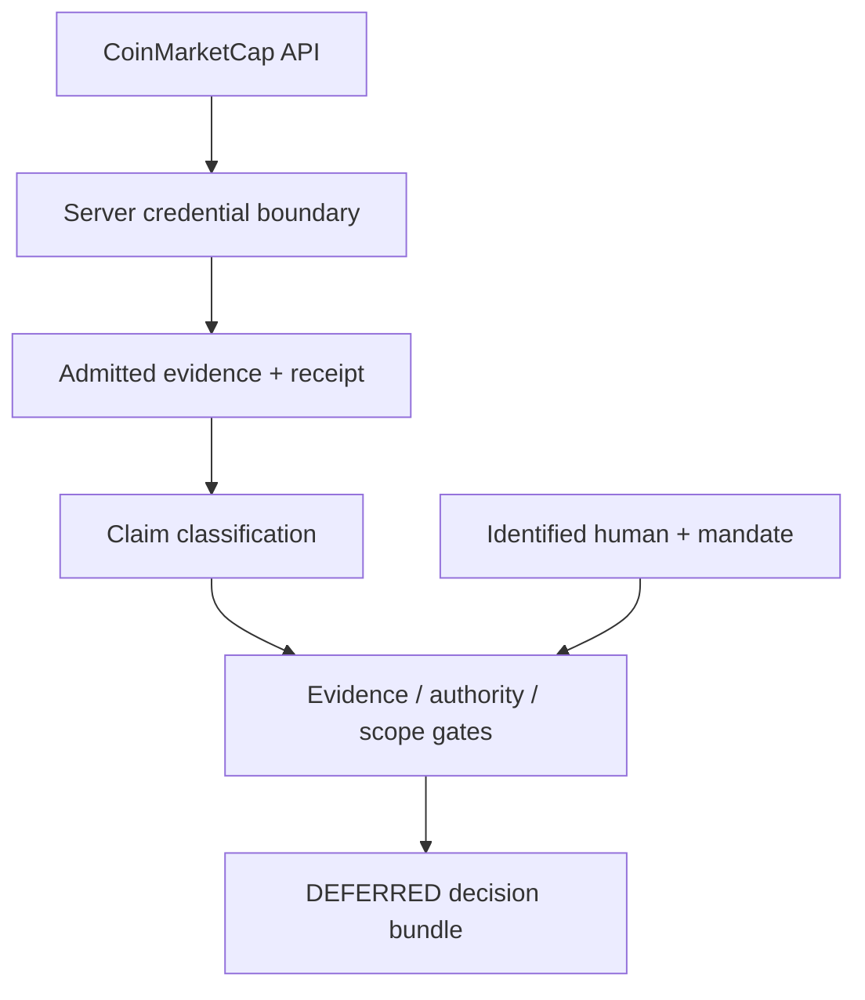

# Proof of Trust — CMC Review

A governed decision-case prototype that separates market evidence from the authority to act.

The prototype captures live CoinMarketCap data through a server-side credential boundary, classifies what the evidence actually supports, checks human identity and mandate, and preserves a **DEFERRED** outcome whenever material evidence or action scope remains unresolved. It can export a canonical, SHA-256-addressed decision bundle for independent verification.

> Proof of Trust is governance research, not financial advice. It does not execute transactions.

## Why this exists

Most decision systems focus on whether an analysis is plausible. Proof of Trust asks a stricter question:

**Is this decision supported by admitted evidence, made by an identified human with a valid mandate, and within a proven scope?**

A correct market calculation cannot replace missing evidence, authority, or scope.

## Version 5 milestone

- Live BTC quote and global-market capture from CoinMarketCap
- API credential held server-side and excluded from receipts and bundles
- Incomplete or failed provider responses rejected rather than admitted
- Claims classified as **Observed**, **Derived**, **Interpreted**, or **Unresolved**
- Analyst and Treasury Custodian roles with different mandates
- Mandatory deferral when counterparty evidence or transaction scope is missing
- Human authorization gate; automation cannot transition a case to `AUTHORIZED`
- Portable canonical JSON decision bundle with an embedded SHA-256 digest

## Demonstration path

1. Open the case at **Evidence review** and capture live CMC evidence.
2. Inspect the sanitized capture receipt and the unresolved counterparty requirement.
3. Open **Claim review** to see the evidence-to-claim boundary.
4. Open **Authority check**. The analyst may analyze but cannot authorize; the custodian's mandate satisfies only the authority gate.
5. Attempt authorization. The case remains **DEFERRED** because evidence and scope are unresolved.
6. Open **Decision** and generate/download the integrity-verifiable decision bundle.

The hosted demonstration is currently private. Judges can run the repository locally using the instructions below; controlled access to the hosted build can be provided separately.

## Architecture



The client never receives the CMC credential. The capture route returns only selected fields and a sanitized receipt. The decision bundle deliberately excludes API credentials, request headers, and raw provider payloads.

## Run locally

Requirements: Node.js `>=22.13.0` and pnpm `11.25.0`.

```bash
pnpm install --frozen-lockfile
cp .env.example .env.local
# Add your CoinMarketCap API key to .env.local
pnpm dev
```

Open the local URL printed by the development server. Without a CMC key, the interface truthfully reports live capture as unavailable and retains the labelled demo fixture.

## Verify the sample decision bundle

The sample bundle is in [`evidence/POT-CMC-001-decision-bundle.json`](evidence/POT-CMC-001-decision-bundle.json). Its embedded digest was independently reproduced as:

```text
c1ad325163678c2f019621702085bc69593a3f7182a1ec1efce22916e6b0855f
```

See [`docs/DECISION_BUNDLE_VERIFICATION.md`](docs/DECISION_BUNDLE_VERIFICATION.md) for the verification record and controlled tamper test.

## Evidence and provenance

- Frozen application source: `f6f7ea1b3b3357c7f266c6e91d5e5f553554f7fd`
- Frozen Site source tag: `pot-v5-freeze`
- Milestone record: [`docs/LIVE_CAPTURE_MILESTONE.md`](docs/LIVE_CAPTURE_MILESTONE.md)
- Hackathon evidence index: [`docs/HACKATHON_EVIDENCE_INDEX.md`](docs/HACKATHON_EVIDENCE_INDEX.md)
- Submission-era live bundle and verification command: [`examples/decision-bundles/`](examples/decision-bundles/)
- Public-repository credential scan: no credential values, bearer tokens, or downloaded secrets found

## Security boundary

- `CMC_API_KEY` is read only by `app/api/cmc/route.ts` on the server.
- `.env*` files are ignored; only `.env.example` is committed.
- Receipts expose endpoint names, HTTP outcomes, schema status, and capture time—not secret headers or raw payloads.
- The repository contains the string `X-CMC_PRO_API_KEY` because that is the required request-header name; it contains no header value.

## Status

Version 5 is frozen for hackathon review. The next work is packaging and judge communication, not adding features to the frozen prototype.

