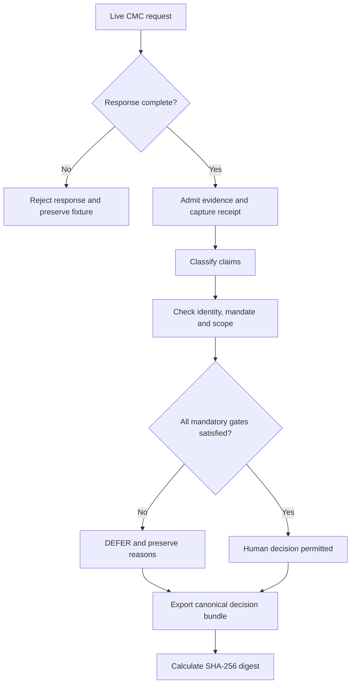

# Proof of Trust — CMC Hackathon Evidence Index

**Evidence index:** POT-CMC-HACK-001  
**Date:** 2026-09-23  
**Frozen baseline:** Version 5  
**Site:** https://proof-of-trust-cmc-review.garth-rt-smith.chatgpt.site

## One-sentence demonstration

Proof of Trust admits live market evidence, separates facts from interpretation, tests identity against legitimate mandate and scope, preserves unresolved requirements, refuses unauthorized advancement, and exports the complete governed decision record as a tamper-evident bundle.

## Frozen implementation

- Repository tag: `pot-v5-freeze`
- Deployed commit: `f6f7ea1b3b3357c7f266c6e91d5e5f553554f7fd`
- Site audience: private, owner-only
- Credential boundary: CoinMarketCap API credential stored as a server-side secret
- Runtime authority boundary: no transaction execution and no automated transition to `AUTHORIZED`

## Demonstrated control sequence

## Evidence inventory

| Evidence | What it proves | Result |
|---|---|---|
| Incomplete-response test | Partial or failed data is not admitted | Passed |
| Live CMC capture | Server-side request and schema validation work | Passed |
| Sanitized capture receipt | Endpoint, HTTP outcome and capture time are preserved without credentials or raw payloads | Passed |
| Claim Review | Observed, Derived, Interpreted and Unresolved claims remain distinct | Passed |
| Maya authority attempt | Valid identity does not create decision authority | Correctly blocked |
| Jonah authority attempt | Custodian mandate can satisfy the authority gate | Passed |
| Mandatory gate evaluation | Valid data and authority cannot override missing evidence or scope | Case remained `DEFERRED` |
| Decision bundle export | Governed case state is portable | Passed |
| Independent digest verification | Canonical payload reproduces embedded SHA-256 | Passed |
| Controlled tamper test | Changing `DEFERRED` to `AUTHORIZED` changes the digest | Tampering detected |

## Bundle verification

- Bundle: `POT-CMC-001-decision-bundle.json`
- Schema: `pot-decision-bundle/v0.1`
- Hashed section: `payload`
- Algorithm: `SHA-256`
- Verified digest: `c1ad325163678c2f019621702085bc69593a3f7182a1ec1efce22916e6b0855f`
- Controlled tamper digest: `fbf5a03682005e7cb653a40face955cb038fa8f2780e7754faecc324005fce61`
- Verification result: original matched; controlled mutation failed comparison

## Demo path for judges

1. Open the private Site.
2. Capture live CMC evidence.
3. Open Claim Review and inspect the four claim classes.
4. Select Maya and attempt authorization; observe the mandate failure.
5. Select Jonah and attempt authorization; observe authority pass.
6. Open Decision; observe that unresolved evidence and scope keep the case `DEFERRED`.
7. Generate and download the decision bundle.
8. Compare the displayed SHA-256 digest with the independent verification record.

## Boundary statement

This prototype performs governance research, not financial advice. It does not execute a transaction, authorize autonomously, retain the CMC credential in exported evidence, or treat a valid calculation as a substitute for sufficient evidence, legitimate mandate, and proven scope.

## Submission positioning

Other projects may produce market intelligence, risk scores, signals, or pre-trade clearance. Proof of Trust operates at the decision-governance layer: it determines whether those outputs may be admitted as evidence, what claims they support, who has authority to rely on them, and whether unresolved conditions require the decision to stop.

**Status:** Version 5 frozen, independently verified, and ready for submission packaging.
